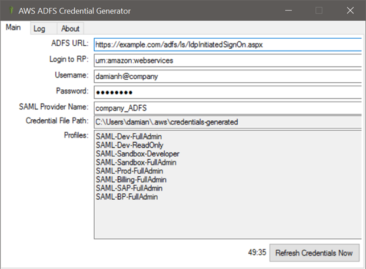

# AWS-ADFS-Credential-Generator

Windows desktop application that generate an AWS Credential file with temporary credentials for ADFS users.
Inspired by [How to Implement Federated API and CLI Access Using SAML 2.0 and AD FS](https://aws.amazon.com/blogs/security/how-to-implement-federated-api-and-cli-access-using-saml-2-0-and-ad-fs/)
this tool is designed for less technically inclined folk who need tooling/API access to AWS but are not CLI comfortable.

[Downloads](https://github.com/damianh/aws-adfs-credential-generator/releases)

Here is a screen shot with typical settings showing the profiles (aka 'Roles') for the given user: 

Here is a screen shot of [S3Browser](http://s3browser.com/) using the generated credential file and one of the profiles:

### How it works

 1. Using the supplied domain credentials, it authenticates against the ASFS url provided using NTLM. The machine running this does not need to be on the domain.
 2. If authentication is successful, the `SAMLResponse` is extracted.
 3. All the Role attributes are extracted from the `SAMLResponse`.
 4. For each Role, temporary credentials are requested from AWS and written to `$USERPROFILE/.aws/credentials-generated`
 5. The temporary credentials are refreshed automatically every 50 minutes (the max lifetime for a AWS temporary credential is 60 minutes).
 6. CLI tooling / S3Browser etc should be configured to use `$USERPROFILE/.aws/credentials-generated`.

### Contributing

This was hacked up on a Saturday night; not meant to be the prettiest. It is a winforms app with all the code in code-behind and zero tests; and that's fine, It Works. Pull requests are welcome, however, create an issue first.
